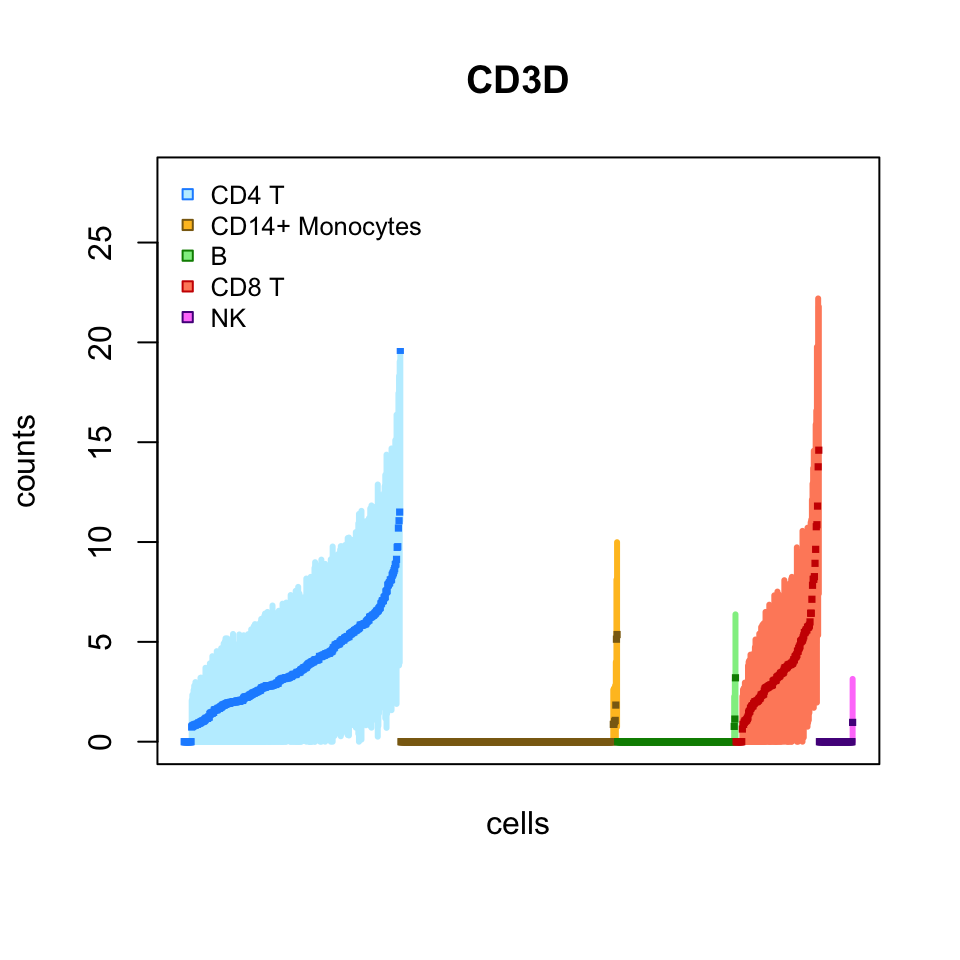
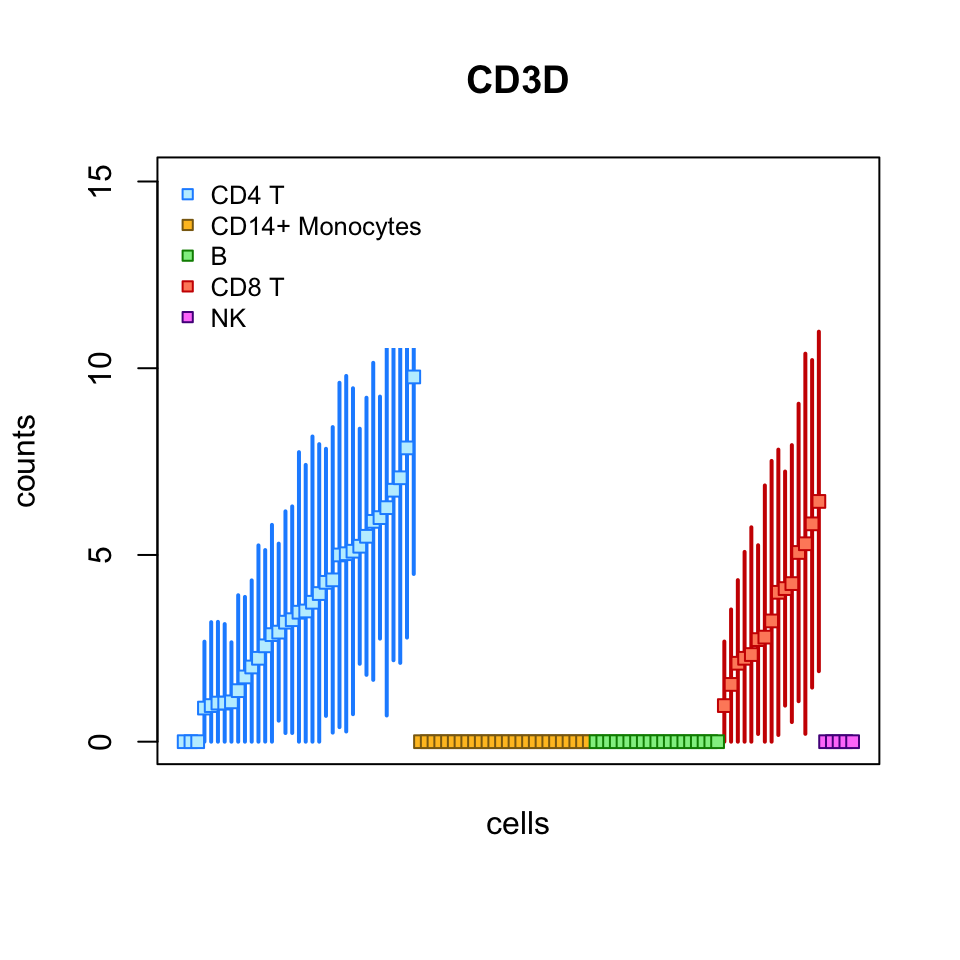
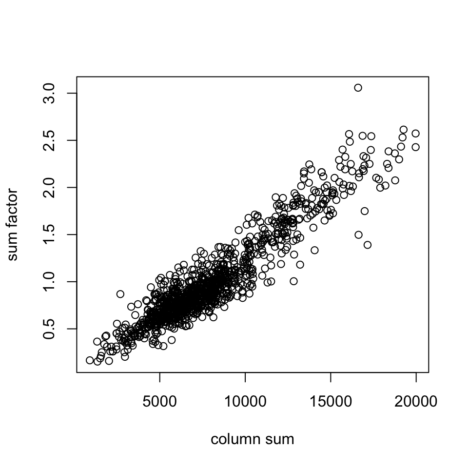
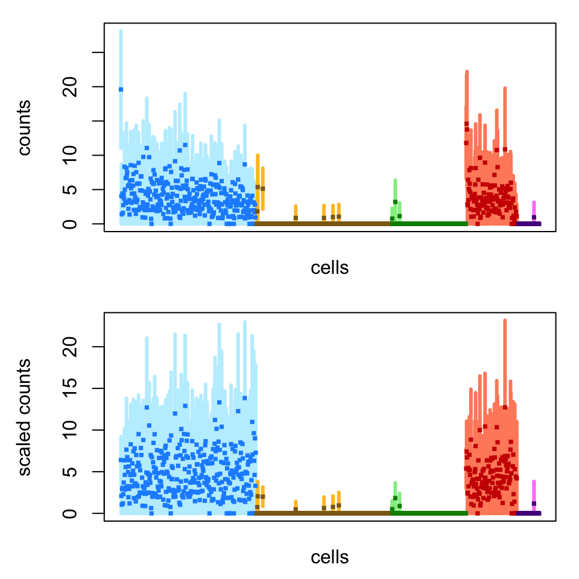
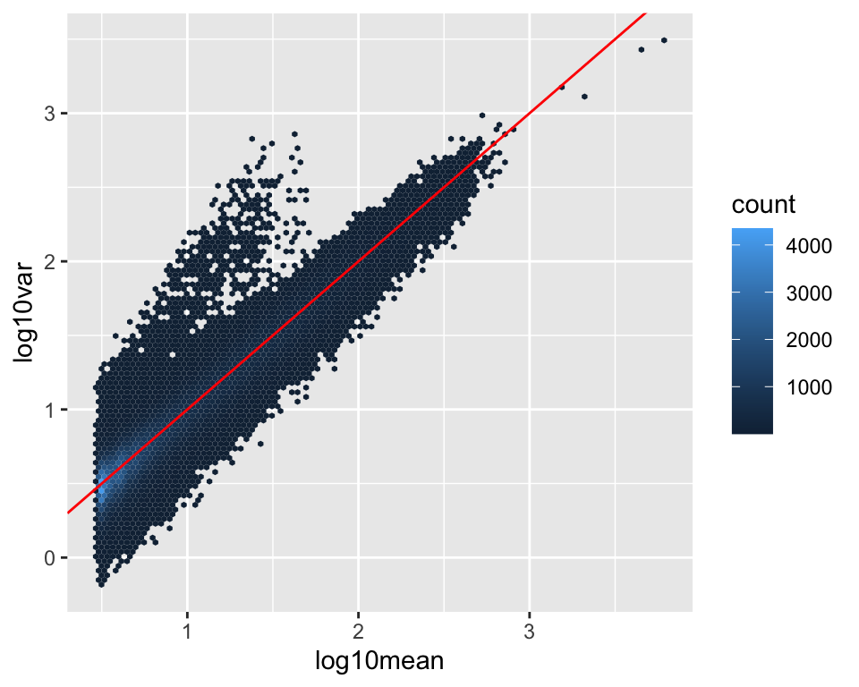
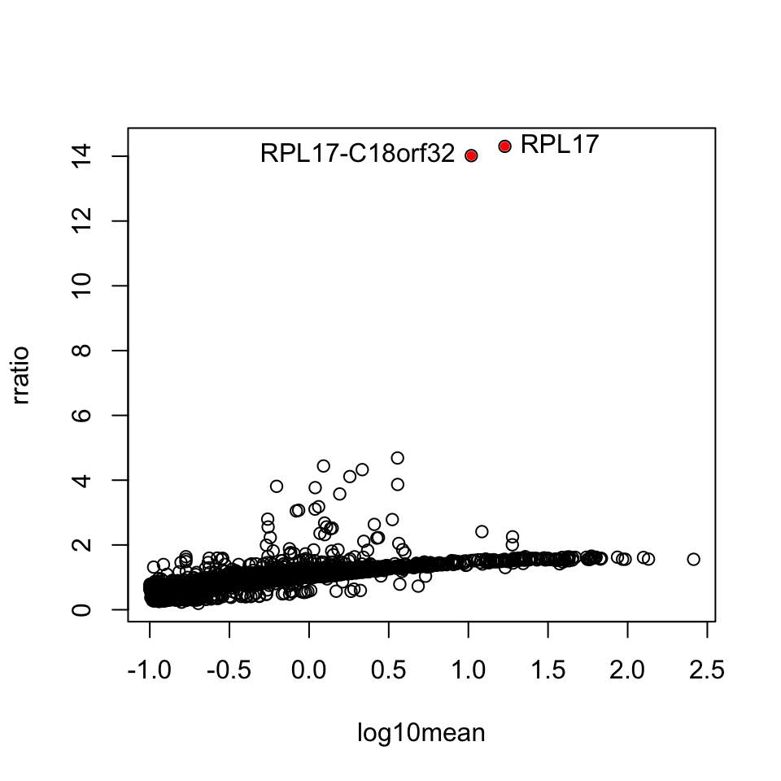
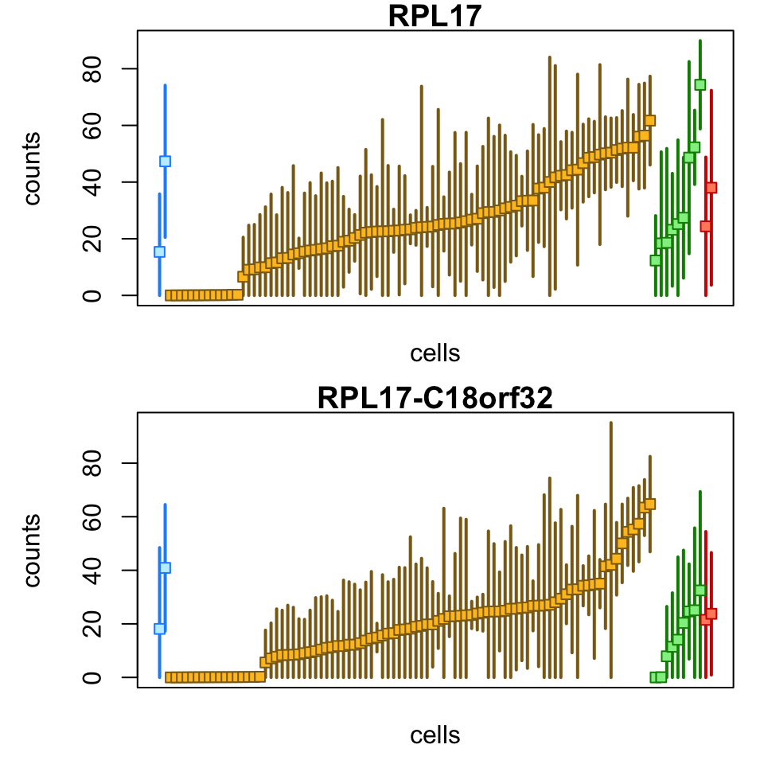
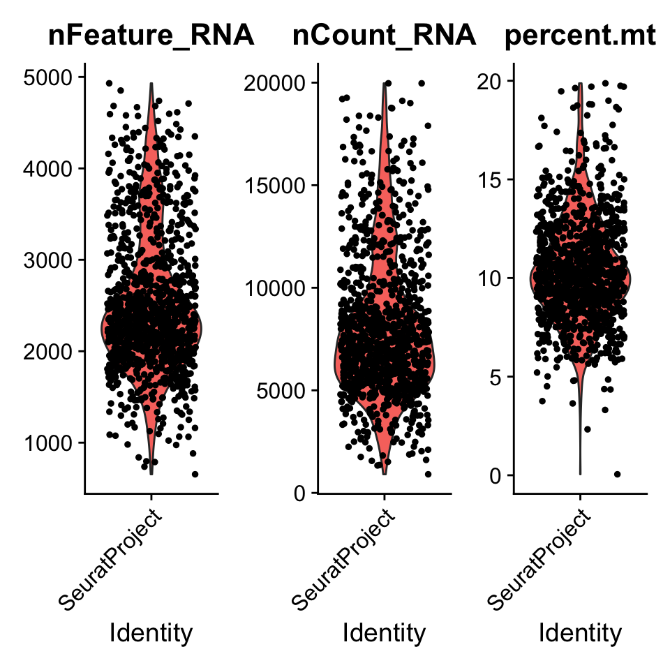

---
output:
  rmarkdown::html_document:
    highlight: pygments
    toc: true
    toc_depth: 3
    fig_width: 5
bibliography: "/Library/Frameworks/R.framework/Versions/4.0/Resources/library/alevin2bioc/vignettes/library.bib"
vignette: >
  %\VignetteIndexEntry{alevin2bioc}
  %\VignetteEngine{knitr::rmarkdown}
  %\VignetteEncoding[utf8]{inputenc}
---

# Importing alevin scRNA-seq counts into R/Bioconductor

## Instructor(s) name(s) and contact information

[Michael Love](https://mikelove.github.io),
[Avi Srivastava](https://k3yavi.github.io)


## Introduction

*alevin* is a fast end-to-end pipeline to process droplet-based
single-cell RNA sequencing (dscRNA-seq) data, generating per-cell gene
count estimates by performing cell barcode detection, read mapping,
and unique molecular identifier (UMI) deduplication.[@alevin]. It
extends the methods in the *Salmon* software [@salmon], and is
distributed as part of *Salmon*.

The data we will use today is generated from the peripheral blood
mononuclear cells (PBMCs) of a healthy donor which have been sequenced
and made public by 10x Genomics (referred as PBMC_1k V2 Chemistry)
[@pbmc]. These cells are well characterized, and so we will examine
counts for cells grouped into cell types labelled by marker genes.

## Running alevin

In order to run *alevin*, we must first generate some metadata. We
will link out to code for the steps for running *alevin*, and focus on
importing data using R code chunks below. The output of running
*alevin* on the PBMC sequence data is included in this workflow
package in the `extdata` directory. *alevin* took about 14 minutes to
quantify 33 million reads from around 1700 cells. 30 bootstrap
inferential replicates were generated, summarized to sparse
inferential mean and variance matrices (discussed later).

The step-by-step guidelines to process the reference sequence and
generate the required data can be found
[here](https://combine-lab.github.io/alevin-tutorial/2018/setting-up-resources/).

Instructions on indexing a set of reference transcripts can be found
[here](https://combine-lab.github.io/alevin-tutorial/2019/selective-alignment/). 
For this experiment, we used the 
[GENCODE](https://www.gencodegenes.org/) 
human reference transcripts [@gencode].

## Importing alevin data with tximeta

We will use *tximeta* to import the *alevin* counts into
R/Bioconductor. The main function `tximeta` reads information from the
entire output directory of *alevin* or *Salmon* in order to
automatically detect and download metadata about the reference
sequences (the transcripts) [@tximeta]. It should work "out of the
box" for human, mouse, and fruit fly reference transcripts from
GENCODE, Ensembl, or RefSeq

First we specify the path where the quantification data is stored. In
this tutorial, the data is stored in an R package, so we need to use
the `system.file` command. 

**Note:** For typical use, you would not use `system.file`, but would
just specify the path to the directory of the output from *alevin*.

**Second note:** when sharing *alevin* or *Salmon* datasets, make sure
to share the entire output directory (you can `zip` or `tar` the
directories to make them into a single share-able file).


```r
# normally you just would use:
# dir <- "/path/to/alevin/output"
extdata <- system.file("extdata", package="alevin2bioc")
dir <- file.path(extdata, "pbmc_1k")
```

We make a vector called `files` (for *alevin* this will point to just
a single file, but with *Salmon* usually one would import multiple
files at a time).


```r
files <- file.path(dir, "alevin", "quants_mat.gz")
file.exists(files)
```

```
## [1] TRUE
```


We can import the *alevin* quantification using the following call to
`tximeta`. The extra argument to *alevin* will filter out cells based
on *alevin*'s post-quantification quality control methods (see paper
for details).


```r
library(tximeta)
se <- tximeta(files, type="alevin", alevinArgs=list(filterBarcodes=TRUE))
```

```
## importing quantifications
```

```
## reading in alevin gene-level counts across cells with fishpond
```

```
## filtering down to 1142 cell barcodes
```

```
## reading in alevin inferential variance with fishpond
```

```
## found matching transcriptome:
## [ GENCODE - Homo sapiens - release 33 ]
```

```
## loading existing TxDb created: 2020-05-13 16:17:46
```

```
## generating gene ranges
```

```
## loading existing gene ranges created: 2020-05-13 16:17:51
```

```
## fetching genome info for GENCODE
```

We can see as it was importing that it automatically detected we are
working with data quantified using GENCODE's *Homo sapiens* reference
transcripts, release 33. The transcript metadata was added
programmatically to the output (this object, `se`). `tximeta` is also
written in such a way that it will avoid unnecessary downloads and
parsing of files -- it will first attempt to find a cached version of
the metadata, to avoid re-downloading or re-parsing these files.

`tximeta` returns a *SummarizedExperiment* [@Lawrence2013]. We can
easily convert this object into a *SingleCellExperiment*
[@Amezquita2020] which has specific slots designed for single-cell
experiment data.


```r
suppressPackageStartupMessages(library(SingleCellExperiment))
sce <- as(se, "SingleCellExperiment")
```

The *SingleCellExperiment* object is used widely across Bioconductor
packages (as you may already know), and so the code up to this point
can be used as an entry point into other Bioconductor single cell
workflows. For more details on working with *SingleCellExperiment*
objects, one can consult the following online book: 
[Orchestrating Single-Cell Analysis with Bioconductor](https://osca.bioconductor.org/)
[@Amezquita2020].

The data is now available as assays in `sce`. We can see what is
available:


```r
assayNames(sce)
```

```
## [1] "counts"   "variance" "mean"
```

And we can access individual gene-by-cell data by pulling out a
particular assay. Note that, due to the use of EM (which avoids
discarding multi-mapping reads), we will have some fractional counts
in the counts matrix.


```r
assays(sce)[["counts"]][1:20,1:4]
```

```
## 20 x 4 sparse Matrix of class "dgCMatrix"
##                   AAGACAACAGATCACT CAGGTATGTCAGTCTA TATCTTGTCCATCTCG TTGTTCACACTTGTGA
## ENSG00000223972.5                .                .                .                .
## ENSG00000227232.5                .                .                .                .
## ENSG00000278267.1                .                .                .                .
## ENSG00000243485.5                .                .                .                .
## ENSG00000284332.1                .                .                .                .
## ENSG00000237613.2                .                .                .                .
## ENSG00000268020.3                .                .                .                .
## ENSG00000240361.2                .                .                .                .
## ENSG00000186092.6                .                .                .                .
## ENSG00000238009.6                .                .                .                .
## ENSG00000239945.1                .                .                .                .
## ENSG00000233750.3                .                .                .                .
## ENSG00000268903.1                .                .                .                .
## ENSG00000269981.1                .                .                .                .
## ENSG00000239906.1                .                .                .                .
## ENSG00000241860.7                1                .                .                .
## ENSG00000222623.1                .                .                .                .
## ENSG00000241599.1                .                .                .                .
## ENSG00000279928.2                .                .                .                .
## ENSG00000279457.4                .                .                .                .
```

For the `counts` matrix, we can also use the `counts()` accessor
function: 


```r
colSums(counts(sce)[,1:4])
```

```
## AAGACAACAGATCACT CAGGTATGTCAGTCTA TATCTTGTCCATCTCG TTGTTCACACTTGTGA 
##            19030            24657            29921            25864
```

## Benefits of tximeta

We can automatically add gene IDs, because *tximeta* knows the type of 
identifiers on the rows of the `sce` object:


```r
library(org.Hs.eg.db) # org pkg for Homo sapiens
sce <- addIds(sce, "SYMBOL")
```

```
## mapping to new IDs using 'org.Hs.eg.db' data package
## if all matching IDs are desired, and '1:many mappings' are reported,
## set multiVals='list' to obtain all the matching IDs
```

```
## it appears the rows are gene IDs, setting 'gene' to TRUE
```

```
## 'select()' returned 1:many mapping between keys and columns
```


```r
mcols(sce)
```

```
## DataFrame with 60233 rows and 2 columns
##                             gene_id      SYMBOL
##                         <character> <character>
## ENSG00000223972.5 ENSG00000223972.5     DDX11L1
## ENSG00000227232.5 ENSG00000227232.5          NA
## ENSG00000278267.1 ENSG00000278267.1   MIR6859-1
## ENSG00000243485.5 ENSG00000243485.5          NA
## ENSG00000284332.1 ENSG00000284332.1   MIR1302-2
## ...                             ...         ...
## ENSG00000198695.2 ENSG00000198695.2         ND6
## ENSG00000210194.1 ENSG00000210194.1          NA
## ENSG00000198727.2 ENSG00000198727.2        CYTB
## ENSG00000210195.2 ENSG00000210195.2          NA
## ENSG00000210196.2 ENSG00000210196.2          NA
```

Also, because the provenance was detected, we also have the ranges of
the genes in their proper genomic context. So it is easy to find, for
example, genes near a particular position in the genome, in this case
4 genes that overlap the range `chr1:10,000,000-10,100,000`.


```r
x <- GRanges("chr1", IRanges(10e6,10.1e6))
sce[sce %over% x,]
```

```
## class: SingleCellExperiment 
## dim: 4 1142 
## metadata(6): tximetaInfo quantInfo ... txomeInfo txdbInfo
## assays(3): counts variance mean
## rownames(4): ENSG00000162444.12 ENSG00000130939.20 ENSG00000224340.1 ENSG00000233623.2
## rowData names(2): gene_id SYMBOL
## colnames(1142): AAGACAACAGATCACT CAGGTATGTCAGTCTA ... CTCTGGTAGTAGGATT AGGAGGTAGGTCACAG
## colData names(0):
## reducedDimNames(0):
## altExpNames(0):
```

## Add cell annotations

Cell annotations were already generated using *Seurat* [@seurat]. The
script is saved in this package in `inst/scripts/seurat.R`. Here we
will use them for size factor estimation and for visualization.


```r
ids <- readRDS(file.path(extdata, "idents.rds"))
top10 <- read.csv(file.path(extdata, "top10.csv"))
```

We subset to the cells that we have IDs for, and attach the labels in
the correct order:


```r
idx <- colnames(sce) %in% names(ids)
table(idx)
```

```
## idx
## FALSE  TRUE 
##    74  1068
```

```r
sce <- sce[,idx]
sce$cluster <- ids[colnames(sce)]
```

The number of cells per cluster:


```r
table(sce$cluster)
```

```
## 
##           CD4 T CD14+ Monocytes               B           CD8 T              NK 
##             346             346             189             133              54
```

Note that the different clusters have different total counts, for
example:


```r
cs <- colSums(assays(sce)[["counts"]])
# cells with higher number of UMI
more.umi <- cs > 10000
(tab <- table(more.umi, sce$cluster))
```

```
##         
## more.umi CD4 T CD14+ Monocytes   B CD8 T  NK
##    FALSE   322             159 165   130  54
##    TRUE     24             187  24     3   0
```

```r
100 * round(prop.table(tab,2),2) # percent
```

```
##         
## more.umi CD4 T CD14+ Monocytes   B CD8 T  NK
##    FALSE    93              46  87    98 100
##    TRUE      7              54  13     2   0
```

```r
# cell with lower number of UMI
fewer.umi <- cs < 5000
(tab <- table(fewer.umi, sce$cluster))
```

```
##          
## fewer.umi CD4 T CD14+ Monocytes   B CD8 T  NK
##     FALSE   316             300 149   107  39
##     TRUE     30              46  40    26  15
```

```r
100 * round(prop.table(tab,2),2) # percent
```

```
##          
## fewer.umi CD4 T CD14+ Monocytes  B CD8 T NK
##     FALSE    91              87 79    80 72
##     TRUE      9              13 21    20 28
```

We have a data.frame with the top marker genes per cluster, as
identified with *Seurat*.


```r
head(top10)
```

```
##   X         p_val avg_logFC pct.1 pct.2     p_val_adj cluster               gene symbol
## 1 1 3.399988e-135 1.2134065 0.997 0.602 6.075778e-131       0 ENSG00000111716.14   LDHB
## 2 2 2.755855e-116 1.0112296 0.879 0.177 4.924713e-112       0 ENSG00000081059.20   TCF7
## 3 3 4.214635e-114 0.9936307 0.968 0.194 7.531553e-110       0  ENSG00000167286.9   CD3D
## 4 4 1.644166e-111 0.9595734 0.855 0.154 2.938125e-107       0 ENSG00000127152.18 BCL11B
## 5 5 9.344999e-110 1.0665597 0.980 0.266 1.669951e-105       0  ENSG00000277734.8   <NA>
## 6 6 2.602057e-105 1.1441765 0.916 0.175 4.649875e-101       0 ENSG00000168685.15   IL7R
##   cluster.name
## 1        CD4 T
## 2        CD4 T
## 3        CD4 T
## 4        CD4 T
## 5        CD4 T
## 6        CD4 T
```

## Plotting counts with uncertainty

In this section, we will begin to plot the counts for cells, for
specific genes, and showing the *inferential uncertainty* as
quantified by *alevin*. This is a unique aspect to the *alevin*
quantification method, that it retains gene multi-mapping reads,
instead of discarding these reads. Note that many reads can be
discarded with alternative pipelines, and these are not uniformly lost
from all genes, but the number of multi-mapping reads is higher for
gene families (i.e. genes with high sequence homology). See the
*alevin* publication for more details on this aspect of bias in
dscRNA-seq counts [@alevin].

*alevin* can also attach a measure of uncertainty to each count in the
matrix. *alevin* computes the mean and variance of *inferential
replicates* which are generated by bootstrapping the read
data. `tximeta` will import these inferential mean and variance
matrices by default (they are also sparse, similar to the counts
matrix).

We will first visualize the uncertainty, and later give an
example of a set of genes where the uncertainty is indicating
significant quantification uncertainty which is useful to consider
when performing EDA (exploratory data analysis) or statistical
analysis.

For a later demonstration of scaling, we will sort the cells by the
total count (this is not something you would necessarily do in a
typical analysis).


```r
o <- order(colSums(assays(sce)[["counts"]]), decreasing=TRUE)
sce <- sce[,o]
```

We can now use a plotting function `plotInfReps` from the *fishpond*
package in order to plot the inferential mean and variance for the
cells, for various genes.


```r
library(fishpond)
plotInfReps(sce, idx="ENSG00000167286.9",
            x="cluster", mainCol="SYMBOL",
            legend=TRUE)
```



Here, we have `x` as a grouping variable for coloring the points, one
can also specify `x` to be a continuous covariate,
e.g. pseudo-time. An additional covariate `cov` can be used for
additional grouping, e.g. batches, donors or lineages.

Here we show the same plot but now subsetting the number of cells: 


```r
set.seed(1)
idx <- sample(ncol(sce),200)
plotInfReps(sce[,idx],
            idx="ENSG00000167286.9",
            x="cluster", mainCol="SYMBOL",
            legend=TRUE)
```


This time only 100 cells:


```r
idx <- sample(ncol(sce),100)
plotInfReps(sce[,idx],
            idx="ENSG00000167286.9",
            x="cluster", mainCol="SYMBOL",
            legend=TRUE)
```



The plots change their features across different sample sizes for ease
of viewing the uncertainty of quantification for individual cells.

We can also choose to plot the cells in their original order (the
default for scRNA-seq is to sort by the mean value):


```r
plotInfReps(sce, idx="ENSG00000167286.9",
            x="cluster", mainCol="SYMBOL",
            reorder=FALSE)
```


## Scaling with size factors

We use `computeSumFactors` [@Lun2016] from the *scran* package
[@scran] to compute size factors that are stored in
`sizeFactors(sce)`. 


```r
library(scran)
sce <- computeSumFactors(sce, clusters=sce$cluster)
plot(cs, sizeFactors(sce), xlab="column sum", ylab="sum factor")
```



Now we demonstrate un-scaled counts and counts scaling with size 
factors just computed. (Note in the second plot that the first cell in
each group isn't the highest anymore.)


```r
par(mfrow=c(2,1), mar=c(2.5,4.5,1,1))
plotInfReps(sce, idx="ENSG00000167286.9",
            x="cluster", main="",
            reorder=FALSE)
plotInfReps(sce, idx="ENSG00000167286.9",
            x="cluster", main="",
            applySF=TRUE, reorder=FALSE)
```



## Inferential variance (uncertainty)

In this second to last section, we will briefly talk about how the
inferential uncertainty as stored in the variance assay may be useful
in practice.

Many users may prefer to just work with the counts matrix, and not
consider the inferential mean and variance. We have found that,
globally, this may not lead to too much of a problem, but for certain
genes, it may be important to use the inferential variance in cases
where it may signal difficult to quantify genes. Inferential
uncertainty for bulk and single cell RNA-seq differential expression
was a focus of the *Swish* nonparametric statistical method [@swish]
which we do not demonstrate here, but one can refer to
the vignette of [swish](https://bioconductor.org/packages/swish) for
more details (in particular the section on *alevin* data).

Let's start by visualizing the uncertainty across all values in the
matrix: 


```r
var <- as.vector(assays(sce)[["variance"]])
mu <- as.vector(assays(sce)[["mean"]])
idx <- mu > 3
df <- data.frame(log10mean=log10(mu[idx]),
                 log10var=log10(var[idx]))
```


```r
library(ggplot2)
ggplot(df, aes(log10mean, log10var)) +
  geom_hex(bins=100) + 
  geom_abline(intercept=0, slope=1, col="red")
```



The values around the red line indicate not much uncertainty
(bootstrapping reads gives us roughly multinomial, and so also
approximately Poisson, variability around the mean count). However we
can see a tail of higher uncertainty values in the matrix, where the
inferential variance is for example, up to 10 times higher than the
mean. 

We can also plot this summarized to a single value per gene, here we
calculate the 99% quantile of the ratio of variance over mean, per
gene, and plot this over the mean:


```r
library(matrixStats)
rratio <- rowQuantiles(as.matrix(
  assays(sce)[["variance"]] /
  (assays(sce)[["mean"]] + 1)), probs=.99)
rmu <- rowMeans(assays(sce)[["mean"]])
idx <- rmu > .1
df <- data.frame(log10mean=log10(rmu[idx]),
                 rratio=rratio[idx],
                 gene=mcols(sce)$SYMBOL[idx])
```

A number of genes have a ratio above 2, but then two genes in this
dataset stand out above the rest, and they happen to be a ribosomal
gene, and another gene that is a read-through of the same locus:


```r
with(df, plot(log10mean, rratio))
high.uncert <- which(df$rratio > 10)
with(df[high.uncert,],
     points(log10mean, rratio, pch=20, col="red"))
with(df[high.uncert,],
     text(log10mean, rratio, gene, pos=c(2,4)))
```



```r
mcols(sce)$SYMBOL[idx][high.uncert]
```

```
##  ENSG00000215472  ENSG00000265681 
## "RPL17-C18orf32"          "RPL17"
```

Some of the counts for the ribosomal gene and its read-through:


```r
par(mfrow=c(2,1), mar=c(2.5,4.5,1,1))
plotInfReps(sce[,1:100], idx="ENSG00000265681.7",
            x="cluster", mainCol="SYMBOL")
plotInfReps(sce[,1:100], idx="ENSG00000215472.10",
            x="cluster", mainCol="SYMBOL")
```



The extra uncertainty on the counts for this gene indicate that
*alevin* was not certain if the reads should come from the gene or its
read-through. While in this case, the ribosomal gene may not be over
interest, there are other cases (e.g. developmental or immune genes
with high sequence homology) where information of the uncertainty of
quantification can be useful in interpreting the data.

## Downstream analysis with Seurat

As we previously showed how to construct a *SingleCellExperiment*
which can be used with other Bioconductor workflows, we also
demonstrate how it is easy to convert the `sce` object into an object
for use with the *Seurat* R package [@seurat] for single cell
analysis. As we noted, *Seurat* was already used to identify the cell
types (with the script stored in `inst/scripts/seurat.R`).

We now load *Seurat* and create a *Seurat* object:


```r
library(Seurat)
cts <- assays(sce)[["counts"]]
pbmc <- CreateSeuratObject(cts)
```

We can easily create violin plots, for example:


```r
mt.genes <- rownames(sce)[as.logical(seqnames(sce) == "chrM")]
pbmc[["percent.mt"]] <- PercentageFeatureSet(pbmc, features=mt.genes)
feats <- c("nFeature_RNA", "nCount_RNA", "percent.mt")
VlnPlot(pbmc, features=feats, ncol=3)
```



From this point, one can use the `pbmc` object for use in *Seurat*
workflows, for example,
the [vignettes](https://satijalab.org/seurat/vignettes.html) on the
*Seurat* website. 

## Support

For support on this tutorial, feel free to post
to <https://support.bioconductor.org> and tag the post with the
appropriate package (e.g. `tximeta` if the question is particular to
the `tximeta` import aspect). If you are asking about a particular
function, don't forget to first read the man page (e.g. `?tximeta`),
and also check the relevant package vignette for relevant details
(e.g. [tximeta vignette](https://bioconductor.org/packages/release/bioc/vignettes/tximeta/inst/doc/tximeta.html)).

For questions about *alevin*, first consult the online documentation
at these links

<https://combine-lab.github.io/alevin-tutorial/>

<https://salmon.readthedocs.io/en/latest/alevin.html>

You can also find links for seeking further support here:

<https://github.com/COMBINE-lab/salmon>

## Session info


```r
sessionInfo()
```

```
## R version 4.0.0 (2020-04-24)
## Platform: x86_64-apple-darwin17.0 (64-bit)
## Running under: macOS Catalina 10.15.4
## 
## Matrix products: default
## BLAS:   /Library/Frameworks/R.framework/Versions/4.0/Resources/lib/libRblas.dylib
## LAPACK: /Library/Frameworks/R.framework/Versions/4.0/Resources/lib/libRlapack.dylib
## 
## locale:
## [1] en_US.UTF-8/en_US.UTF-8/en_US.UTF-8/C/en_US.UTF-8/en_US.UTF-8
## 
## attached base packages:
## [1] stats4    parallel  stats     graphics  grDevices datasets  utils     methods   base     
## 
## other attached packages:
##  [1] Seurat_3.1.5                ggplot2_3.3.0               scran_1.17.0               
##  [4] fishpond_1.5.21             org.Hs.eg.db_3.11.1         SingleCellExperiment_1.11.1
##  [7] SummarizedExperiment_1.19.2 DelayedArray_0.15.1         matrixStats_0.56.0         
## [10] tximeta_1.7.3               GenomicFeatures_1.41.0      AnnotationDbi_1.51.0       
## [13] Biobase_2.49.0              GenomicRanges_1.41.1        GenomeInfoDb_1.25.0        
## [16] IRanges_2.23.4              S4Vectors_0.27.5            BiocGenerics_0.35.2        
## [19] testthat_2.3.2              rmarkdown_2.1               devtools_2.3.0             
## [22] usethis_1.6.1              
## 
## loaded via a namespace (and not attached):
##   [1] reticulate_1.15               tidyselect_1.0.0              RSQLite_2.2.0                
##   [4] htmlwidgets_1.5.1             grid_4.0.0                    BiocParallel_1.23.0          
##   [7] Rtsne_0.15                    munsell_0.5.0                 codetools_0.2-16             
##  [10] ica_1.0-2                     statmod_1.4.34                future_1.17.0                
##  [13] withr_2.2.0                   colorspace_1.4-1              knitr_1.28                   
##  [16] ROCR_1.0-11                   listenv_0.8.0                 labeling_0.3                 
##  [19] tximport_1.17.0               GenomeInfoDbData_1.2.3        farver_2.0.3                 
##  [22] bit64_0.9-7                   rprojroot_1.3-2               vctrs_0.2.4                  
##  [25] xfun_0.13                     BiocFileCache_1.13.0          R6_2.4.1                     
##  [28] ggbeeswarm_0.6.0              rsvd_1.0.3                    locfit_1.5-9.4               
##  [31] AnnotationFilter_1.13.0       bitops_1.0-6                  assertthat_0.2.1             
##  [34] promises_1.1.0                scales_1.1.1                  beeswarm_0.2.3               
##  [37] gtable_0.3.0                  npsurv_0.4-0.1                globals_0.12.5               
##  [40] processx_3.4.2                ensembldb_2.13.1              rlang_0.4.6                  
##  [43] splines_4.0.0                 rtracklayer_1.49.1            lazyeval_0.2.2               
##  [46] hexbin_1.28.1                 reshape2_1.4.4                BiocManager_1.30.10          
##  [49] yaml_2.2.1                    backports_1.1.6               httpuv_1.5.2                 
##  [52] tools_4.0.0                   ellipsis_0.3.0                RColorBrewer_1.1-2           
##  [55] sessioninfo_1.1.1             ggridges_0.5.2                Rcpp_1.0.4.6                 
##  [58] plyr_1.8.6                    progress_1.2.2                zlibbioc_1.35.0              
##  [61] purrr_0.3.4                   RCurl_1.98-1.2                ps_1.3.3                     
##  [64] prettyunits_1.1.1             openssl_1.4.1                 pbapply_1.4-2                
##  [67] viridis_0.5.1                 cowplot_1.0.0                 zoo_1.8-8                    
##  [70] ggrepel_0.8.2                 cluster_2.1.0                 fs_1.4.1                     
##  [73] magrittr_1.5                  data.table_1.12.8             lmtest_0.9-37                
##  [76] RANN_2.6.1                    ProtGenerics_1.21.0           fitdistrplus_1.0-14          
##  [79] pkgload_1.0.2                 hms_0.5.3                     patchwork_1.0.0              
##  [82] lsei_1.2-0.1                  mime_0.9                      evaluate_0.14                
##  [85] xtable_1.8-4                  XML_3.99-0.3                  gridExtra_2.3                
##  [88] compiler_4.0.0                biomaRt_2.45.0                scater_1.17.0                
##  [91] tibble_3.0.1                  KernSmooth_2.23-17            crayon_1.3.4                 
##  [94] htmltools_0.4.0               later_1.0.0                   tidyr_1.0.3                  
##  [97] DBI_1.1.0                     dbplyr_1.4.3                  MASS_7.3-51.6                
## [100] rappdirs_0.3.1                Matrix_1.2-18                 cli_2.0.2                    
## [103] igraph_1.2.5                  pkgconfig_2.0.3               GenomicAlignments_1.25.0     
## [106] plotly_4.9.2.1                vipor_0.4.5                   dqrng_0.2.1                  
## [109] XVector_0.29.0                stringr_1.4.0                 callr_3.4.3                  
## [112] digest_0.6.25                 tsne_0.1-3                    sctransform_0.2.1            
## [115] RcppAnnoy_0.0.16              Biostrings_2.57.0             leiden_0.3.3                 
## [118] uwot_0.1.8                    edgeR_3.31.0                  DelayedMatrixStats_1.11.0    
## [121] curl_4.3                      shiny_1.4.0.2                 Rsamtools_2.5.0              
## [124] gtools_3.8.2                  lifecycle_0.2.0               nlme_3.1-147                 
## [127] jsonlite_1.6.1                BiocNeighbors_1.7.0           desc_1.2.0                   
## [130] viridisLite_0.3.0             askpass_1.1                   limma_3.45.0                 
## [133] fansi_0.4.1                   pillar_1.4.4                  lattice_0.20-41              
## [136] fastmap_1.0.1                 httr_1.4.1                    pkgbuild_1.0.8               
## [139] survival_3.1-12               interactiveDisplayBase_1.27.0 glue_1.4.0                   
## [142] remotes_2.1.1                 png_0.1-7                     BiocVersion_3.12.0           
## [145] bit_1.1-15.2                  stringi_1.4.6                 blob_1.2.1                   
## [148] BiocSingular_1.5.0            AnnotationHub_2.21.0          memoise_1.1.0                
## [151] dplyr_0.8.5                   irlba_2.3.3                   future.apply_1.5.0           
## [154] ape_5.3
```

## References
